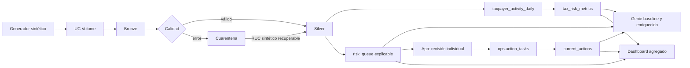

# Arquitectura · Radar Tributario

> Todos los datos son sintéticos. La arquitectura produce señales explicables
> para priorizar revisión; no determina fraude ni reemplaza el debido proceso.

## Flujo

## Responsabilidades

- Bronze conserva contribuyentes, comprobantes y declaraciones recibidos.
- Silver aplica RUC/check, integridad referencial, duplicados y montos.
- Cuarentena conserva causas y resolución; solo recupera el RUC sintético
  determinístico.
- Gold publica actividad diaria, cola explicable, calidad y metric view.
- Genie compara respuestas sin contexto contra respuestas gobernadas.
- App revisa casos y escribe decisiones limitadas.
- Dashboard muestra patrones agregados, calidad y seguimiento; no casos.
- ops conserva el workflow transaccional y Change Data Feed.

## Señales

`risk_queue` combina brecha de ventas, crédito fiscal excesivo, rectificatorias
inusuales, emisión inactiva/dormida y duplicados. El puntaje es una suma de
pesos transparente y didáctica, no un modelo de culpabilidad.

## Contratos

`tax_risk_metrics` expone `declared_sales`, `assessed_tax`,
`claimed_tax_credit`, `taxpayers_count`; dimensiones `event_date`, `region`,
`segment`, `economic_activity`.

`action_tasks` separa decisión humana, estado, responsable, notas, prioridad,
contribuyente sintético, puntaje, autor y timestamps. Genie no escribe.

## Gobierno

Schemas por participante, identidades separadas, mínimo privilegio, consultas
parametrizadas, linaje y CDF. Para producción se requieren datos autorizados,
validación legal/metodológica, controles de acceso, monitoreo y revisión humana.
