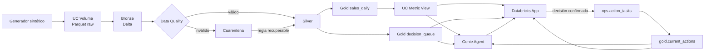

# Arquitectura del laboratorio

## Flujo

## Responsabilidad por capa

| Capa | Responsabilidad | No debe hacer |
|---|---|---|
| Volume | Conservar archivos raw gobernados | Definir métricas |
| Bronze | Fidelidad y trazabilidad de ingesta | Corregir silenciosamente |
| Silver | Calidad, normalización y cuarentena | Elegir acciones de negocio |
| Gold | Métricas, riesgo y productos de consumo | Ejecutar decisiones |
| Metric View | Semántica común | Guardar estado operacional |
| Genie | Analizar y recomendar | Escribir datos |
| App | Presentar evidencia y confirmar acciones | Ejecutar SQL enviado por el browser |
| `ops.action_tasks` | Persistir decisión y workflow | Reemplazar el histórico analítico |

## Modelo de datos

### Bronze

- `stores`: maestro de 120 sucursales.
- `products`: maestro de 400 productos.
- `inventory_snapshot`: inventario, tránsito, punto de reorden y lead time.
- `sales_events`: eventos de venta a escala.

### Silver

- `sales`: ventas válidas y enriquecidas.
- `inventory`: posiciones válidas.
- `quarantine_sales`: ventas rechazadas y estado de reproceso.
- `quarantine_inventory`: inventario rechazado.
- `data_quality_metrics`: fallas y tasa por regla.

### Gold

- `sales_daily`: grano día-sucursal-producto-canal.
- `decision_queue`: una alerta por sucursal-producto.
- `retail_performance_metrics`: medidas y dimensiones certificadas.
- `data_quality_summary`: calidad explicada al negocio.
- `current_actions`: vista de decisiones operativas.

### Operacional

- `action_tasks`: decisión, responsable, SLA, estado y evidencia de contexto.

## Identidades

Las notebooks se ejecutan con la identidad del participante. La App utiliza su
service principal para consultar y escribir únicamente recursos declarados.
`X-Forwarded-Email` conserva la identidad humana que confirmó la operación.

## Write-back

La App no acepta valores de prioridad, producto, sucursal ni unidades enviados
por el navegador. El backend recibe `alert_id` y recupera el contexto desde
Gold dentro del mismo `INSERT ... SELECT`.

Una sola operación crea simultáneamente la decisión y la tarea. Esto evita una
transacción distribuida entre dos tablas.

## Escalabilidad

- Spark `range` genera datos sin saturar el driver.
- Las escrituras se reparten por fecha y particiones de ejecución.
- Delta Lake aporta ACID y Change Data Feed.
- Liquid clustering organiza las tablas de consumo.
- SQL warehouse atiende la concurrencia de Genie y la App.
- La App limita resultados y usa consultas parametrizadas.

## Extensiones posteriores

- Sustituir reglas de demanda por forecasting.
- Enviar cambios de `action_tasks` a Slack, Jira o un ERP.
- Aplicar row filters por provincia.
- Mover workflow transaccional a Lakebase si la concurrencia OLTP lo exige.
- Automatizar evaluación y promoción de Genie Spaces.
